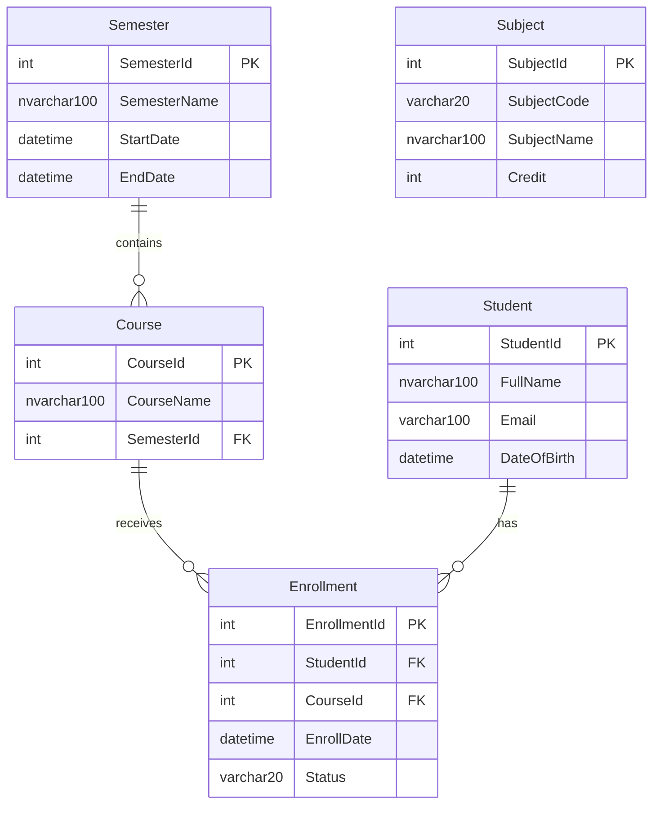

# Mô hình dữ liệu LMS

Phạm vi: thiết kế, chưa có migration hoặc DB chạy thật. Căn cứ: B trang 1 và G trong [nguồn](sources.md), coverage D01–D06; theo dõi ở [issue #3](https://github.com/danhnguyenthanh260/prn232-lab1-lms/issues/3).

## ERD

Trong sơ đồ, `nvarchar100` là ký hiệu gọn của `nvarchar(100)`, không phải kiểu SQL thực tế. Cardinality một cha trên mỗi con là đề xuất mapping từ FK; nullability chưa được đề quy định rõ.

## Từ điển dữ liệu

| Bảng | Cột và kiểu SQL theo đề | Khóa/quan hệ |
|---|---|---|
| Semester | SemesterId int; SemesterName nvarchar(100); StartDate datetime; EndDate datetime | PK SemesterId |
| Course | CourseId int; CourseName nvarchar(100); SemesterId int | PK CourseId; FK SemesterId → Semester |
| Student | StudentId int; FullName nvarchar(100); Email varchar(100); DateOfBirth datetime | PK StudentId |
| Enrollment | EnrollmentId int; StudentId int; CourseId int; EnrollDate datetime; Status varchar(20) | PK EnrollmentId; FK StudentId → Student; CourseId → Course |
| Subject | SubjectId int; SubjectCode varchar(20); SubjectName nvarchar(100); Credit int | PK SubjectId; độc lập |

Student và Course có quan hệ nhiều–nhiều thông qua Enrollment; Enrollment mang thêm ngày đăng ký và trạng thái. **Không tự thêm Course.SubjectId:** schema nguồn chưa có quan hệ Subject–Course (DEC-02).

## Quyết định triển khai còn mở

| Điểm | Đề xuất, không phải yêu cầu đã được giảng viên duyệt | Chủ issue |
|---|---|---|
| Sinh ID | int identity do DB sinh; không cho nhập ID khi tạo Student | #3, #15 |
| Nullability | Chốt required/optional của từng cột khi mapping; API validation phải khớp | #3, #5 |
| Uniqueness | Không mặc định unique Email, SubjectCode hoặc cặp StudentId/CourseId | #3 |
| Status | Chuỗi tối đa 20; chưa có danh sách enum chuẩn trong nguồn | #3, #9 |
| Xóa Student có Enrollment | DEC-04 đề xuất xóa enrollment của student và student trong cùng transaction; phải chốt trước thực hiện | #3, #15 |
| Hiệu năng | Index FK là đề xuất; không đổi kiểu/độ dài cột để tối ưu tùy ý | #3 |
| Ngày tháng | Chốt serialization/ngữ nghĩa DateOfBirth; tránh đổi ngày do timezone ở UI | #5, #15 |

Không thêm Users, Roles, Lessons, Grades, Streaks hoặc Points chỉ vì tham chiếu giao diện Duolingo.

## Mapping tới API và nghiệm thu

Entity nằm ở Repositories; response DTO không trả nguyên đồ thị EF. Tầng Services định hình dữ liệu, controller trả envelope. Xem [routes](api-routes.md).

- So đủ 5 bảng, 20 cột, 5 PK, 3 FK với migration/SQL; không có bản ghi mồ côi.
- Kiểm Student ↔ Enrollment ↔ Course và Course ↔ Semester bằng dữ liệu DB, không chỉ JSON có key.
- Detail trả đầy đủ quan hệ trực tiếp được chốt, không cắt 5 bản ghi theo cách lấy mẫu của grader; nested DTO hữu hạn, không vòng lặp.
- Ghi rõ các quyết định trên trước khi nghiệm thu; chưa có bằng chứng runtime trong tài liệu này.
